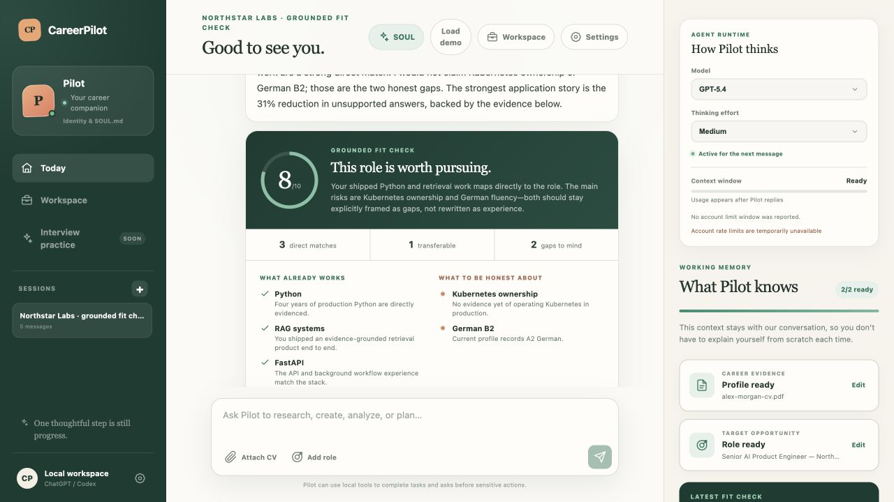
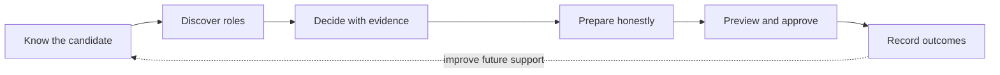
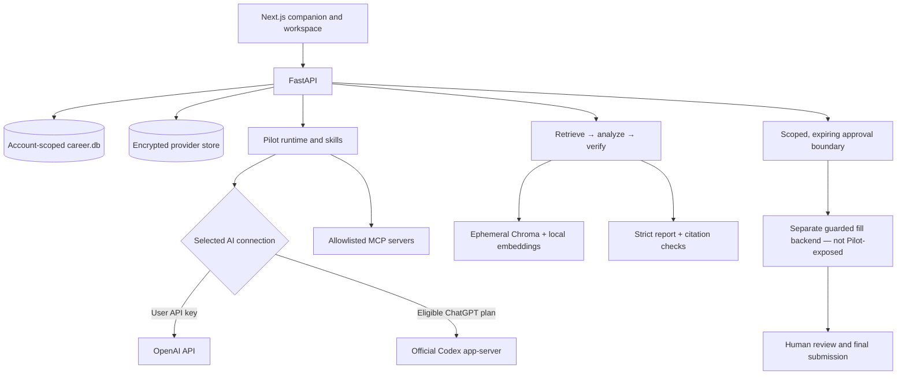

# CareerPilot

> **Automate the search. Keep the truth.**

CareerPilot is a local-first, evidence-grounded job-search companion. Its agent, **Pilot**,
keeps the working context, explains its recommendations with evidence, and pauses before
consequential actions.

[](https://www.python.org/)
[](https://nextjs.org/)




## Why CareerPilot

Most job-search AI generates text. CareerPilot is being built to carry a long-running,
high-stakes workflow:

- **One companion, not a panel of bots.** Pilot has a persistent identity, conversation
  sessions, working context, model controls, and a user-owned personality.
- **Evidence before confidence.** Fit feedback separates demonstrated, adjacent, missing,
  and unsupported skills, with a citation behind every displayed match.
- **A real operating workspace.** Reviewed career facts, projects, jobs, applications,
  artifact versions, approvals, model routes, revisions, and audit events survive restarts.
- **Human control at the boundary.** Pilot may research, prepare, and create a local
  evidence-bound field preview. A separate guarded browser-fill backend exists, but it is
  not exposed to Pilot; the user remains responsible for review and final submission.
- **Local and extensible.** The current product runs on one trusted device using an OpenAI
  API key or eligible ChatGPT/Codex access, with skills and allowlisted MCP connections.

## Product loop



The workspace already covers most of this loop. Pilot and the dedicated guided UI can read
one bounded public Greenhouse or Lever board, preview without selecting or storing anything,
save only checked roles, rank them deterministically, and carry an explicit choice into the
pipeline. The next milestone is extending that same evidence and approval contract through
tailoring, interview practice, and scheduled search queues.

## What works today

| Area | Status | Current capability |
|---|---:|---|
| Pilot conversations | ✅ Ready | Persistent sessions, rename/delete, stored CV and role context, fit reports, model and reasoning controls |
| Identity and personality | ✅ Ready | Custom name and SOUL notes mirrored to readable local files; protected safety policy remains read-only |
| Guided setup and recovery | ✅ Ready | Five-step Settings navigator, six independently retryable reads, preserved loaded data and unsaved drafts, stale-response suppression, and account-bound Codex authorization attempts |
| Career evidence | ✅ Ready | PDF/DOCX workspace import, editable claims, source excerpts, verification state, work authorization, languages |
| Project evidence | ✅ Ready | Read-only local or public GitHub analysis, technologies, improvements, and interview questions |
| Grounded fit | ✅ Ready | 0–10 fit report with demonstrated, adjacent, missing, requirements, actions, and unsupported-claim warnings |
| Job queue | ✅ Ready | Manual/CSV import, URL deduplication, deterministic ranking, filters, and visible score reasons |
| Application pipeline | ✅ Ready | Detailed stages, next actions, status history, follow-ups, artifact versions, and explicit manual-submission confirmation |
| Tailoring | 🟡 Partial | Draft/PDF/version-approval foundations exist; cited evidence snapshots, unsupported-gap handling, and retry/concurrency safety are being hardened before this is meetup-ready |
| Agent resources | ✅ Ready | Visible read-only built-ins, editable user resources, four curated preview-before-install skill starters, strict single-file skill import, and explicit user-skill export |
| MCP customization | ✅ Ready | Presets and custom stdio/HTTP servers with explicit tool allowlists and disabled-by-default risky integrations |
| Revision safety | 🟡 Partial | Skill/rubric proposals support evaluation, quarantine, activation, and rollback. Explicit supported memory corrections become inactive review drafts; existing active evaluated memory is used at runtime |
| Job discovery | ✅ Ready | Pilot plus a dedicated known-board UI can preview bounded public Greenhouse/Lever roles, start with zero selected or saved, persist only checked roles through canonical deduplication, then rank, track, approve, or archive an explicit selection |
| Form assistance | 🟡 Partial | Pilot can create evidence-bound local field previews without opening a form on POSIX systems with secure directory-descriptor storage; it fails closed elsewhere. A guarded browser-fill backend exists separately and is not exposed to Pilot |
| Long-term memory | 🟡 Partial | Pilot performs bounded deterministic retrieval across active evaluated memories and recorded outcomes. The privacy-safe inspector shows what was considered, not answer-level attribution; semantic/vector retrieval is still planned |
| Interview practice | ⬜ Planned | The navigation placeholder exists; the guided practice and feedback experience does not |
| Local release bundle | 🟡 Partial | Source distributions and wheels include a reproducibly verified static UI with build-ID and artifact-integrity checks; clean-platform install verification is still planned |
| Public deployment | ⬜ Planned | The current product is a trusted single-user local app with no public multi-user authentication boundary |

**Legend:** ✅ usable in the current local build · 🟡 real foundation with incomplete
orchestration/UX · ⬜ not implemented yet

Selecting a starter or importing one regular UTF-8 `SKILL.md` file (64 KiB maximum)
creates a browser preview only. A separate **Install skill** action uses the existing guarded
resource API; name conflicts stay in preview for renaming and never overwrite built-in or
user-owned skills. Strict imports accept canonical names up to 64 characters and
descriptions up to 1,024 characters without angle brackets. Export is available only for a
selected user-owned skill and downloads
only its exact saved `SKILL.md` content under a deterministic Markdown filename. CareerPilot
adds no credentials, workspace paths, or hidden response metadata to that file. Exact export
does not redact anything the user intentionally saved inside the skill content.

## What to show in a meetup

The [HTML meetup deck](docs/meetup-slides.html) is a keyboard-controlled, printable
13-slide story built from the real current interface. Open the file directly, or serve the
repository so its current product screenshots resolve:

```bash
python3 -m http.server 8080
```

Then open `http://127.0.0.1:8080/docs/meetup-slides.html`.

Recommended five-minute demo:

1. Open Settings or Pilot and show the guided setup, identity, persistent session, and working context.
2. Open `/discover`, preview one known public board, and point out that zero roles begin selected or saved.
3. Check one role, then ask whether it is worth pursuing; open the grounded fit card.
4. Show one demonstrated claim, one adjacent skill, one honest gap, and—if pre-warmed—the privacy-safe memory inspector.
5. Move the role through the ranked queue and application stage with a visible next action.
6. End at the boundary: CareerPilot keeps preparation local; the user reviews and submits.

The credential-free seed supplies the profile, queue, application stages, and audit-safe
story. It intentionally does not fabricate a provider-generated fit report, retrieval
history, public provider response, or artifact pack; pre-warm those optional steps or use
the deck's clearly labelled deterministic guided-discovery screenshot fallback.

The deck supports `←` / `→`, `PageUp` / `PageDown`, `Home` / `End`, `F` for fullscreen,
`N` for speaker notes, and `D` to open the default local product URL.

## Architecture



Provider credentials are encrypted separately from career workflow data. Chroma is
ephemeral per fit analysis and never becomes the durable profile store. LangGraph covers
the meaningful retrieve/analyze/verify stages; identity handling, parsing, validation,
approvals, and deterministic grounding checks remain plain Python.

Read the [architecture notes](docs/architecture.md) and
[security model](docs/security.md) for the trust boundaries and tradeoffs.

## Local installation

Requirements: Python 3.12+ and Node.js 20.9+.

macOS and mainstream Linux:

```bash
./install.sh
```

Windows 11 PowerShell:

```powershell
Set-ExecutionPolicy -Scope Process Bypass
./install.ps1
```

Open `http://127.0.0.1:8787`. Installation does not require a provider credential. In
Settings, connect either:

| Connection | Billing and access |
|---|---|
| **ChatGPT plan through Codex** | Uses limits included with an eligible ChatGPT plan and requires a compatible Codex CLI/runtime already installed |
| **OpenAI API key** | Uses a user-owned OpenAI Platform project with separate usage billing |

CareerPilot never silently falls back from one provider to the other. Credentials are
encrypted before local storage.

See the [installation guide](docs/installation.md) for integrity checks, backup/restore,
platform notes, and the Docker fallback.

### Development setup

```bash
uv sync --dev --extra companion
cp .env.example .env
uv run fastapi dev --no-proxy-headers
```

In a second terminal:

```bash
cd frontend
npm ci
cp .env.example .env.local
npm run dev
```

Open `http://localhost:3000`. The development UI defaults to
`http://localhost:8000`; change `NEXT_PUBLIC_API_BASE_URL` and the backend
`FRONTEND_ORIGINS` allowlist when using different origins.

### Docker fallback

```bash
docker compose up --build
```

Keep the mounted `/app/.data` volume private. Do not run multiple API replicas against
the same SQLite database; move operational storage to PostgreSQL before horizontal scale.

## Safety and privacy contract

CareerPilot is intentionally conservative around career claims and external actions:

- A **matched** skill requires direct candidate evidence and a verified quote.
- An **adjacent** skill may be transferable but cannot be described as equivalent.
- A **missing** skill remains a visible gap and can become a preparation action.
- An **unsupported** claim is warned about and excluded from tailored facts.
- Final application submission, LinkedIn applications, employer messages, and connection
  requests are not autonomous actions.
- Tool output, job pages, uploaded documents, email, and MCP responses are untrusted input.
- Provider keys, local databases, uploaded documents, browser state, and generated
  artifacts must never be committed.

Conversation messages, CV/role text, and fit reports persist in the account-scoped local
database until the user deletes the session. Workspace source documents remain local so
reviewed claims retain their evidence. Optional Langfuse traces may include CV and role
text; keep tracing disabled unless policy and consent cover that data.

Current ingestion limits:

- Conversation uploads: 5 MB, 30 PDF pages, 20 MB expanded DOCX, 50,000 extracted characters.
- Workspace imports: PDF or DOCX up to 20 MB, with a hashed local source copy.
- PDF parsing uses embedded text. Image-only scans need the planned OCR flow.

## Tests and evaluations

The normal test path requires no provider credential and makes no paid model calls:

```bash
uv run python -m pytest -q
uv run python -m evals.run_evals
uv run python -m scripts.demo_preflight

cd frontend
node --test test/*.test.ts
npm run lint
npx tsc --noEmit --allowImportingTsExtensions
npm run build
```

The current clean integrated audit passes **703 backend tests** with **6
platform-specific skips**, plus **60 frontend unit tests**. The count includes the offline
wheel/source-distribution contracts; those checks intentionally reject ignored local
frontend dotenv files, so release verification runs from clean release inputs. The offline
evaluator validates **25 strong, partial, and mismatch cases**; frontend lint, the compatible
TypeScript check, and the Next.js 16.2.10 Turbopack production build also pass.

One explicit provider-backed smoke test is available:

```bash
uv run python -m scripts.live_smoke
```

It requires `OPENAI_API_KEY` in the shell and can incur charges. Full live evaluations are
also opt-in:

```bash
uv run python -m evals.run_evals --live --output evals/results/live.json
```

Use `--case strong_python_rag_match` to limit a paid run to one named case.

## Roadmap / TODO

This list separates meetup/release gates from the features that turn the current workspace
into a genuinely proactive job-search agent.

### P0 — meetup and local-alpha confidence

- [ ] Run one live ChatGPT/Codex conversation and grounded fit check.
- [ ] Run one live OpenAI API-key smoke test.
- [ ] Verify a clean macOS install from the packaged path.
- [ ] Verify clean Windows 11 and mainstream Linux installs.
- [ ] Build and run the Docker fallback on a clean machine.
- [ ] Complete a backup/restore drill with provider credentials excluded.
- [ ] Inspect one opt-in Langfuse trace and confirm privacy wording.
- [ ] Rehearse the five-minute story with the seeded/screenshot fallback.
- [x] Bundle a reproducibly verified static UI and reject stale, mixed-build, or tampered release artifacts.

### P1 — guided product experience

- [x] Add a first-run checklist: connection → profile → target → first fit check.
- [x] Give Pilot and Workspace one clear primary “next best action.”
- [x] Add five-step Settings guidance with independently recoverable reads and preserved drafts.
- [x] Explain deterministic queue score versus evidence-grounded 0–10 fit score.
- [ ] Add multiple named CV/profile versions for different role families.
- [ ] Add OCR for image-only and scanned PDFs.
- [ ] Finish the Interview Practice workspace with evidence-aware feedback.
- [ ] Close its acceptance blockers: stale cross-tab retries, unlocked canonical
  reconciliation, incomplete request cancellation, restart-scoped cleanup lockout,
  post-success refresh errors, browser-history reconciliation, and duplicate/orphaned labels.
- [ ] Improve empty states, error recovery, accessibility, responsive layouts, and keyboard flow.
- [x] Add a reusable, non-sensitive seeded demo workspace command.

### P1 — agent orchestration and safe automation

- [x] Expose Greenhouse/Lever discovery through Pilot.
- [x] Add a dedicated guided discovery experience to the primary UI.
- [ ] Let Pilot orchestrate discover → deduplicate → rank → track → tailor in one conversation.
- [ ] Finish the evidence-first tailoring pack with exactly three reviewed drafts and
  prevent generic status overrides from bypassing artifact review.
- [ ] Make tailoring migrations repair partial schemas, preserve the one-pack uniqueness
  boundary, and define a safe live-data downgrade/upgrade policy.
- [ ] Bind every tailoring claim to an intact stored source and explicit user-confirmation
  provenance instead of trusting a client-declared `verified` label.
- [x] Add a guided, deterministic local form-field preview from verified evidence and approved artifacts.
- [ ] Pass native Windows CI and integrate the independently reviewed secure Windows
  form-preview storage candidate; current `main` still fails closed before any file or
  database mutation on unsupported platforms.
- [ ] Add a separately confirmed external fill phase around the existing guarded backend.
- [ ] Surface approval history and explain exactly what each token authorizes.
- [ ] Add safe daily/weekly search queues with a visible pause switch and budget.
- [ ] Draft follow-ups from recorded outcomes; never send without a user preview and approval.
- [x] Capture submission and employer outcomes as structured learning signals.

### P1 — memory and self-evolution

- [x] Add bounded deterministic cross-session retrieval over active evaluated memories and prior outcomes.
- [ ] Add semantic/vector retrieval once the retention and production-storage contract is defined.
- [ ] Cite career evidence in ordinary conversation, not only formal fit reports.
- [x] Expose a bounded, privacy-safe API showing why memory was retrieved for a turn.
- [x] Add the user-facing retrieval inspector to Pilot.
- [x] Convert explicit supported career-preference corrections into inactive, reviewable revision proposals.
- [ ] Convert broader repeated corrections and outcomes into bounded revision proposals.
- [ ] Replay/evaluate proposed skill and rubric changes against fixed cases.
- [x] Apply active, evaluated memory revisions to the runtime.
- [ ] Apply active, evaluated skill and rubric revisions to the runtime.
- [ ] Add clear revision comparison and evaluation-detail UI; activation, quarantine, and rollback foundations already exist.
- [ ] Define retention, deletion, and consent controls for learned memories.

### P2 — extensibility

- [ ] Add connection health checks and tool discovery for MCP servers.
- [ ] Add guided OAuth for selected Gmail/Calendar/Drive connectors.
- [x] Add four curated, preview-before-install job-search skill templates.
- [x] Add bounded single-file import and exact-content export for user-owned skills.
- [ ] Extend safe import/export to user-owned rubrics and memories.
- [ ] Add per-tool budgets, rate limits, and richer audit views.
- [ ] Publish the extension contract without exposing protected core policy.

### P2 — public and multi-user deployment

- [ ] Add a real authentication and authorization boundary.
- [ ] Move operational storage to PostgreSQL and semantic memory to a production vector store.
- [ ] Add tenant isolation, retention controls, consent records, and deletion workflows.
- [ ] Add request rate limiting, abuse controls, secret rotation, and incident procedures.
- [ ] Add production CI/CD, migrations, health checks, backups, and rollback.
- [ ] Add privacy-safe observability, SLOs, cost budgets, and usage reporting.
- [ ] Complete a security review before any public internet exposure.

## Parallel implementation lanes

Roadmap work runs in isolated git worktrees so each boundary can be tested and reviewed
before it reaches `main`:

| Lane | Status | Primary scope | Next gate |
|---|---:|---|---|
| `memory-runtime` | ✅ Integrated | Deterministic retrieval, citations, inspector, finite preference drafts, atomic rollback | Define retention before adding semantic retrieval |
| `agent-orchestration` | ✅ Integrated | Discover → deduplicate → rank → track → approve/archive with an exact Pilot tool boundary | Extend the accepted authorization contract into dedicated downstream workflows |
| `guided-settings` | ✅ Integrated | Five-step setup, independent recovery, draft preservation, stale-read suppression, and account-bound Codex attempts | Extend the same recovery clarity to future consequential-action screens |
| `guided-discovery` | ✅ Integrated | Loopback-only known-board preview, bounded reads, zero default selection, checked canonical saves, and dedicated `/discover` UI | Orchestrate the accepted path into evidence-safe tailoring without broadening authority |
| `guided-practice` | ⏸️ Preserved | First run, isolated interview practice, grounded feedback, and resilient UX | Resume only after explicit approval, then close seven accepted concurrency, cancellation, history, cleanup, and accessibility findings |
| `release-hardening` | 🟡 Install rehearsal | Reproducible static bundle, installers, Docker, backup, and smoke tests | Rehearse clean macOS/Windows/Linux installs and the Docker fallback |
| `tailoring-drafts` | ⏸️ Preserved | Evidence-safe CV, cover-letter, and interview drafts from an approved saved role | Resume only after explicit approval, then fix status bypass, partial/round-trip migrations, and stored-source confirmation |
| `form-fill-workspace` | ✅ Integrated | Persistent evidence-bound local preview on secure POSIX storage; no browser or external mutation | Accept a Windows backend only after native CI, then design a separately confirmed external fill phase |
| `windows-preview-storage` | 🟡 Native CI required | Independently reviewed Windows no-follow temporary storage, atomic publish, cleanup, and conflict normalization | Run the mandatory `windows-latest` selection with zero skips before integration |
| `skill-starter-library` | ✅ Integrated | Four concise job-search starters, preview-only strict import, guarded explicit install, and exact user-skill export | Evaluate additional user-owned extension types without weakening protected policy |

Each lane starts with an explicit interface contract. Database migrations stay owned by
one lane at a time, and integration uses small reviewed commits instead of a shared mutable
worktree.

## API map

<details>
<summary>Useful local and development endpoints</summary>

- `GET /health` — process health.
- `GET /local/session` — initialize and return the automatic local workspace.
- `GET /settings/providers` — connected and active AI providers.
- `POST /settings/providers/api-key` — validate, encrypt, and activate an OpenAI key.
- `POST /settings/providers/codex/start` — start local Codex authorization.
- `POST /settings/providers/select` — switch between existing connections.
- `GET|PUT /settings/agent-identity` — persistent name and supplemental SOUL notes.
- `GET /settings/agent-resources` — editable memories and visible skills.
- `POST|PUT|DELETE /settings/agent-resources/{kind}/...` — guarded user resource changes.
- `POST /api/v1/jobs/discover-public` — loopback-only bounded preview of one public Greenhouse or Lever board; stores zero jobs.
- `GET|POST /companion/sessions` — list or create persistent sessions.
- `GET|PUT|DELETE /companion/sessions/{id}` — restore, rename, or delete a session.
- `PUT /companion/sessions/{id}/context` — persist CV, role, and fit context.
- `GET /companion/sessions/{id}/memory-retrievals` — bounded, privacy-safe retrieval provenance.
- `POST /companion/chat` — contextual Pilot conversation.
- `POST /companion/chat/stream` — structured chat and career-tool events over SSE.
- `POST /parse-cv` — bounded PDF, DOCX, or TXT extraction.
- `POST /match` — retrieval, provider analysis, and grounding validation.
- `GET|POST /api/v1/jobs` plus discovery, import, and score routes — deduplicated job queue.
- `GET|POST /api/v1/applications` plus status and artifact routes — pipeline and versioned materials.
- `GET|POST /api/v1/applications/.../form-preview` — deterministic local-only field plans; no URL, selector, browser, upload, or submission surface.
- `GET /api/v1/model-routes` and `PUT /api/v1/model-routes/{route_name}` — task-specific model and cost controls.
- `GET|POST /api/v1/revisions`, `POST /{id}/evaluate`, and `POST /{id}/rollback` — reversible user-owned revisions.
- `GET|POST /settings/mcp` and `PUT|DELETE /settings/mcp/{name}` — allowlisted MCP configuration.
- `/docs` — interactive OpenAPI documentation in development.

</details>

## Repository guides

- [Installation](docs/installation.md)
- [Architecture](docs/architecture.md)
- [Security](docs/security.md)
- [Demo script](docs/demo-script.md)
- [Meetup slides](docs/meetup-slides.html)
- [Build-week plan](docs/build-week-plan.md)
- [Release-status audit](docs/release-status.md)

CareerPilot is an active local-first alpha. Do not expose the current server directly to
the public internet. Report security-sensitive issues privately to the repository owner
instead of opening a public issue containing credentials or personal data.
