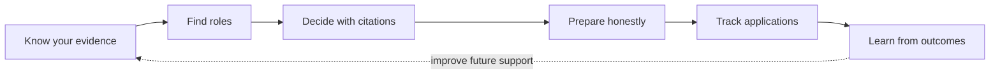
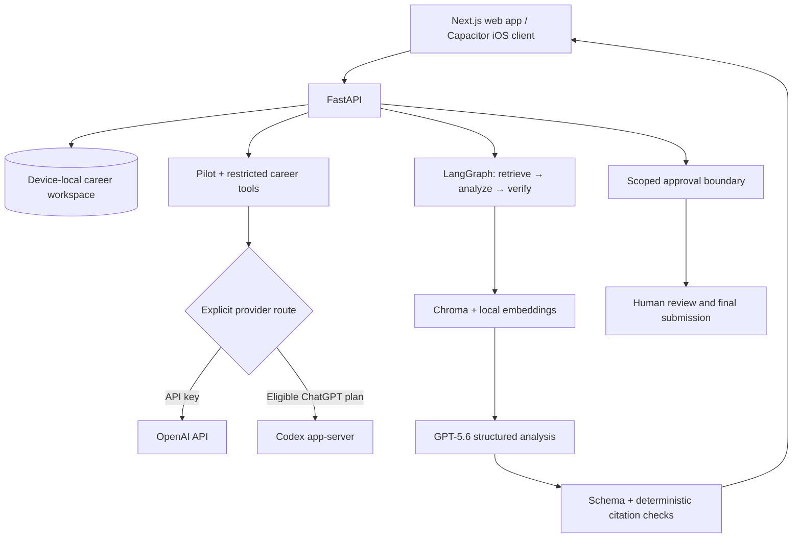

<h1 align="center">
  
  CareerPilot
</h1>

<p align="center">
  <strong>One place to get all your job hunting done. Your AI partner who helps, understands, and grows with you.</strong>
</p>

<p align="center">
  <a href="https://github.com/lololo-xiao/career-pilot/tree/build-week-2026"></a>
  
  
  <a href="https://www.python.org/"></a>
  <a href="https://nextjs.org/"></a>
  <a href="LICENSE"></a>
</p>

<p align="center">
  
  <br />
  <sub>Image inspired by <a href="https://youtu.be/HAsFPfjQRAA?si=5n4u_C2TW0i9v1rl">「夕空の紙飛行機」</a>, the ending theme from one of my favorite manga/anime, <em>Hajime no Ippo</em> 🥊.</sub>
</p>

## Introduction

CareerPilot is a local-first, evidence-grounded workspace for the whole job search. Its AI
partner, **Pilot**, carries context across conversations, understands a candidate through
reviewed career evidence, finds and ranks roles, explains fit with citations, tracks
applications, and helps prepare the next step.

The core idea is simple: job hunting needs continuity, but high-stakes career claims need
proof. CareerPilot combines a persistent companion with deterministic safeguards so it can
move the work forward without inventing experience or taking consequential actions on the
user's behalf.



### What it does today

| Journey | CareerPilot capability |
| --- | --- |
| **Understand** | Import PDF, DOCX, or TXT career material; review facts, projects, work authorization, languages, and source excerpts. |
| **Discover** | Preview bounded Greenhouse or Lever boards, select deliberately, deduplicate, and save only chosen roles. |
| **Decide** | Produce a 0–10 fit report that separates demonstrated skills, adjacent skills, honest gaps, requirements, and next actions. |
| **Prepare** | Keep evidence-bound drafts and local field previews separate from final application submission. |
| **Track** | Rank the job queue with visible reasons, manage application stages, follow-ups, artifacts, and outcomes. |
| **Control** | Record scoped, expiring, one-use approvals and show exactly what each approval does—and does not—authorize. |

CareerPilot runs as a local web app and as an optional Capacitor iOS client connected to a
private CareerPilot runtime. It is currently a single-user local alpha, not a public
multi-user service.

## Demo

<p align="center">
  <strong>See the complete job-search workflow in under three minutes.</strong><br />
  <sub>2:57 · 4K master · Higgs TTS 3 narration · fictional, credential-free workspace</sub>
</p>

https://github.com/user-attachments/assets/94b4fb8e-8dbe-4674-b19e-ba0f99704fe7

## Quick start

### 1. Install and launch

Requirements: **Python 3.12+** and **Node.js 20.9+**.

```bash
git clone https://github.com/lololo-xiao/career-pilot.git
cd career-pilot
./install.sh
```

On Windows 11 PowerShell:

```powershell
git clone https://github.com/lololo-xiao/career-pilot.git
cd career-pilot
Set-ExecutionPolicy -Scope Process Bypass
./install.ps1
```

The installer builds the app, verifies the runtime, and opens
`http://127.0.0.1:8787`. Use `--no-start` on macOS/Linux or `-NoStart` on Windows to
install without launching.

### 2. Choose an AI connection

Open **Settings → AI connection** and choose one explicit route:

- **OpenAI API key** for project-billed model access; the formal fit path defaults to GPT-5.6 Sol.
- **ChatGPT plan through Codex** for an eligible plan and compatible local Codex runtime.

CareerPilot encrypts provider credentials locally and never silently switches billing
routes.

### 3. Try the product loop

Load the fictional demo workspace or import your own profile, then:

1. review the extracted career evidence;
2. add or discover a role;
3. ask Pilot whether the role is worth pursuing;
4. inspect the citations, gaps, and preparation actions; and
5. move the role into the application pipeline.

For Docker, development, backup/restore, and platform notes, see the full
[installation guide](docs/installation.md).

<details>
<summary><strong>Development setup</strong></summary>

```bash
uv sync --dev --extra companion
cp .env.example .env
# Replace CAREERPILOT_AUTH_SECRET in .env with a random 32+ character value.
uv run fastapi dev --no-proxy-headers
```

In a second terminal:

```bash
cd frontend
npm ci
cp .env.example .env.local
npm run dev
```

Open `http://localhost:3000`.

</details>

### Optional iOS simulator

On macOS with Xcode and an iOS Simulator runtime installed:

```bash
./scripts/ios simulator
```

The iOS app is a private client for the same CareerPilot UI; Python, Codex, storage, and
automation stay on the trusted runtime. Read the [publishing playbook](docs/ios-publishing-playbook.md)
before device or TestFlight distribution.

## Architecture



The model is responsible for synthesis, not truth enforcement. Chroma narrows the
admissible candidate evidence; GPT-5.6 returns a strict schema; Pydantic validates the
shape; and plain Python verifies every cited source ID and verbatim quote before the report
is displayed.

Key implementation choices:

- **Local-first source of truth.** Career data and conversation state live in an
  account-scoped SQLite workspace; provider credentials are stored separately and
  encrypted.
- **Explicit routing.** API-key billing and ChatGPT/Codex access are separate choices with
  no silent fallback.
- **Bounded agency.** Pilot can research, organize, explain, and prepare. Final submission,
  employer messages, and professional-network actions remain human.
- **Observable and testable.** The retrieve → analyze → verify stages have distinct traces,
  failure modes, offline fixtures, and evaluation cases.

See the [architecture notes](docs/architecture.md), [security model](docs/security.md), and
[release status](docs/release-status.md) for the detailed boundaries and current gates.

## Safety and privacy

Career content, job pages, uploaded documents, and tool responses are treated as untrusted
input. A displayed match must cite candidate evidence; adjacent experience is never
silently promoted to direct experience; unsupported claims remain warnings; and approvals
are scoped to one exact action with an expiry and usage limit.

The current service has no public authentication boundary. Keep it on loopback or behind a
trusted private access layer, and never commit `.env`, provider credentials, local
databases, uploaded documents, or browser state.

## Tests and evaluations

The normal verification path makes no paid provider calls:

```bash
uv run python -m pytest -q
uv run python -m evals.run_evals
uv run python -m scripts.demo_preflight

cd frontend
node --test test/*.test.ts
npm run lint
npx tsc --noEmit --allowImportingTsExtensions
npm run build
```

Provider-backed smoke tests are intentionally opt-in because they can consume quota or
incur charges.

## Built with GPT-5.6 and Codex

This project uses GPT-5.6 and Codex in two distinct ways: **inside the product** and
**throughout the engineering workflow**.

### Where GPT-5.6 is used

The direct OpenAI path defaults to **`gpt-5.6-sol`** for the formal fit report. In
[`app/matching.py`](app/matching.py), GPT-5.6 receives the job description plus only the
candidate evidence retrieved for that request and must return the strict
`MatchResponse` JSON Schema. [`app/workflow.py`](app/workflow.py) places that generation
between retrieval and verification; [`app/grounding.py`](app/grounding.py) then rejects
unknown source IDs, altered quotes, or unsupported claims.

That division was a key technical decision: use GPT-5.6 for nuanced requirement extraction
and synthesis, while keeping provenance enforcement deterministic and independently
testable.

### Where Codex is used

Codex is both a product route and the development accelerator behind the Build Week
implementation:

| Area | How Codex helped |
| --- | --- |
| **Product runtime** | [`app/codex_runtime.py`](app/codex_runtime.py) connects an eligible ChatGPT plan through the official app-server protocol. Each structured analysis runs in an ephemeral, read-only workspace with tools disabled and approvals set to never. |
| **Architecture** | Codex helped trace the existing contracts across FastAPI, Next.js, SQLite, Hermes, LangGraph, and the native client before proposing bounded changes. |
| **Implementation** | Isolated branches and worktrees let Codex advance focused lanes—grounding, approvals, memory, discovery, release hardening, and iOS—without mixing unfinished work. |
| **Verification** | Codex translated risk decisions into regression tests, ran targeted suites after each change, and used failures to tighten concurrency, storage, prompt-injection, and cross-platform boundaries. |
| **Release work** | Codex coordinated the iOS client, reproducible static bundle, installer checks, architecture documentation, this README, and the narrated demo while preserving one auditable Git history. |

### Key decisions made during the build

| Decision | Why it matters | Where it lives |
| --- | --- | --- |
| Retrieve before generation | The model sees a bounded evidence set instead of an unstructured profile. | [`app/retrieval.py`](app/retrieval.py), [`app/workflow.py`](app/workflow.py) |
| Verify after generation | Fluency cannot substitute for source integrity. | [`app/grounding.py`](app/grounding.py) |
| Keep provider routes explicit | Users can understand access, billing, and data flow. | [`app/auth.py`](app/auth.py), [`app/codex_runtime.py`](app/codex_runtime.py) |
| Separate preparation from action | A useful agent does not need permission to submit applications. | [`career_companion/services/form_preview.py`](career_companion/services/form_preview.py), [`docs/security.md`](docs/security.md) |
| Make iOS a thin private client | The native experience stays lightweight without embedding secrets or the Python runtime. | [`frontend/capacitor.config.ts`](frontend/capacitor.config.ts), [`docs/ios-deployment.md`](docs/ios-deployment.md) |

Codex shortened the path from idea to tested implementation, but the product direction,
privacy posture, evidence rules, and final release decisions remained human choices. That
collaboration is central to CareerPilot's own philosophy: AI should increase momentum
without hiding judgment or removing control.

## Build Week snapshot

The hackathon submission is frozen at the annotated Git tag
[`build-week-2026`](https://github.com/lololo-xiao/career-pilot/tree/build-week-2026).
The tag preserves the exact code, documentation, iOS client, and demo reviewed for the
submission while `main` can continue to evolve afterward.

## License

CareerPilot is licensed under the [Apache License 2.0](LICENSE).
