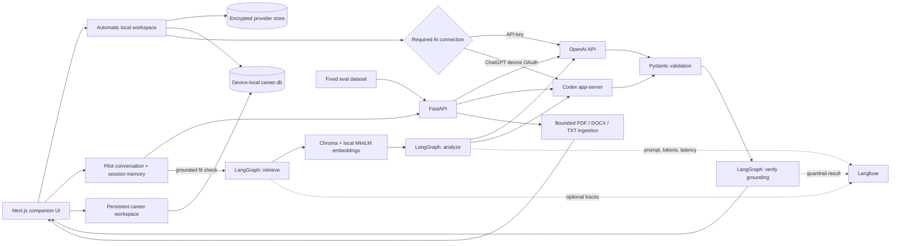

# CareerPilot

CareerPilot is a local-first AI career companion for discovering opportunities, reviewing
career evidence, comparing a profile with a role, and managing applications. Instead of
asking users to orchestrate specialist agents, it provides one consistent partner—Pilot—
that holds the working context and explains the tools and permissions it wants to use.

The product combines a conversation with a persistent, local career workspace. Pilot can
discuss direction and next steps through `POST /companion/chat`; the existing retrieval
and grounding workflow appears inside that conversation as a fit-check capability rather
than as the whole UI. The local `/workspace` stores reviewed career evidence,
jobs, applications, artifacts, approvals, model routes, and reversible learned revisions
in a device-local operational database. Temporary conversation context remains
request-scoped until the user explicitly saves it to that workspace.

CareerPilot requires no product account or sign-in. It creates one stable local workspace,
then requires either ChatGPT plan access through the official Codex app-server runtime or
a user-owned OpenAI API key. Both paths power Pilot and the same grounded match workflow.
The stack includes Next.js, FastAPI, encrypted provider and search credentials,
SQLAlchemy/Alembic operational storage, LangGraph, local
Chroma retrieval, strict structured outputs, deterministic citation checks, and optional
Langfuse tracing. Automated tests never make provider or telemetry calls.

## Demo experience

- **One companion:** Pilot has a stable identity and speaks as a collaborative partner.
- **Working memory:** the current profile, role, and fit report stay available throughout
  the browser session so follow-up questions have context.
- **Persistent workspace:** reviewed evidence, job ranking, application state, artifacts,
  approvals, model controls, and learned revisions survive browser sessions on this device.
- **Capabilities, not agents:** uploading a CV and running a grounded fit check are tools
  within the conversation.
- **Understandable tool use:** approval cards summarize the intended action, name the
  tool and behavior, and keep technical code collapsed unless the user opens it.
- **Visible setup state:** Settings shows which tools and MCP connections are ready,
  limited, disabled, or require configuration, including live web search.
- **Editable agent workspace:** Settings exposes local memory files, built-in and
  user-owned skills, and MCP server configuration with guarded create, edit, and remove
  flows.
- **Opt-in LinkedIn search:** A disabled-by-default community MCP preset can search jobs
  and read job details through `uvx`; messaging, connection, posting, and application
  tools are not allowlisted.
- **Human-controlled evidence:** extracted claims can be corrected, recategorized,
  verified, or removed before Pilot relies on them.
- **Honesty by design:** candidate-specific advice is grounded in supplied evidence, and
  the formal report still verifies every displayed quote deterministically.

## Product contract

The report distinguishes four cases:

- **Matched:** the job skill is directly supported by a verbatim candidate quote.
- **Adjacent:** explicit candidate experience is transferable, but not equivalent.
- **Missing:** the job asks for a skill that has no adequate candidate evidence.
- **Unsupported:** a tempting application claim would overstate the available evidence.

The API returns a 0–10 score, concise summary, matched and adjacent skills with citations,
missing skills, important job requirements, preparation actions, and unsupported-claim
warnings.

## Architecture



Chroma remains ephemeral per analysis and never stores profiles. The encrypted local
SQLite store contains the stable device identity and provider credentials. A separate
device-scoped `career.db` contains reviewed career
facts and workflow state, without provider credentials. LangGraph
coordinates only the three meaningful analysis stages; local identity handling, chunking,
Pydantic validation, and citation verification remain plain Python. See the
[architecture notes](docs/architecture.md) for trust boundaries and tradeoffs.

## Local setup

The supported local path requires Python 3.12+ and Node.js 20.9+. It creates isolated
Career Companion and Hermes environments, builds the browser interface, verifies and
installs Tectonic, installs Playwright Chromium, initializes a private local secret, and
opens the loopback application.

macOS and mainstream Linux:

```bash
./install.sh
```

Windows 11 PowerShell:

```powershell
Set-ExecutionPolicy -Scope Process Bypass
./install.ps1
```

The native interface is `http://127.0.0.1:8787`; no provider key is required during
installation. Users choose their own OpenAI API key or ChatGPT/Codex authorization after
opening the app. API charges remain separate from ChatGPT plan usage and the product never
silently falls back between them. See the [installation guide](docs/installation.md) and
[security model](docs/security.md) for supported platforms, integrity checks, backups,
customization, and safe limitations.

For development, install the locked dependencies and create `.env` from the example:

```bash
uv sync --dev --extra companion
cp .env.example .env
```

Run the API:

```bash
uv run fastapi dev
```

In a second terminal, install and run the frontend:

```bash
cd frontend
npm ci
cp .env.example .env.local
npm run dev
```

Open `http://localhost:3000`. The frontend defaults to `http://localhost:8000` for
the API. Set `NEXT_PUBLIC_API_BASE_URL` in `frontend/.env.local` when the API is
elsewhere, and set backend `FRONTEND_ORIGINS` to a comma-separated list of allowed UI
origins.

Useful endpoints:

- `GET /health` — process health check; no provider credentials required.
- `GET /local/session` — initialize and return the automatic local workspace.
- `GET /settings/providers` — show the connected and active AI providers.
- `GET /settings/capabilities` — show ready, limited, setup-required, and disabled
  Pilot tools plus MCP allowlists.
- `PUT /settings/capabilities/web-search` — encrypt and enable a user-owned Brave
  Search key without changing the selected AI provider.
- `DELETE /settings/capabilities/web-search` — remove the saved search key and disable
  live web search.
- `GET /settings/agent-resources` — list editable memory files and visible skills.
- `POST|PUT|DELETE /settings/agent-resources/{kind}/...` — create, edit, or remove
  user-owned memory and skill files; built-in skills remain read-only.
- `GET /settings/mcp` — list MCP presets and custom server settings.
- `POST|PUT|DELETE /settings/mcp/...` — add, edit, enable, disable, or remove an MCP
  server with an explicit tool allowlist.
- `POST /settings/providers/api-key` — validate, encrypt, and activate an OpenAI key.
- `POST /settings/providers/codex/start` — start local-workspace Codex authorization.
- `POST /settings/providers/select` — switch between existing provider connections.
- `DELETE /settings/providers/{provider}` — remove a provider connection.
- `POST /parse-cv` — bounded PDF, DOCX, or TXT extraction.
- `POST /companion/chat` — contextual conversation with Pilot.
- `POST /companion/chat/stream` — route-selected Hermes conversation with structured
  message and career-tool progress events over SSE.
- `POST /match` — retrieval, provider analysis, and grounding validation.
- `GET /api/v1/jobs` — list opportunities in the persistent local workspace.
- `POST /api/v1/jobs` — save and deduplicate a manual opportunity.
- `GET /api/v1/applications` — list tracked applications and artifact versions.
- `GET /api/v1/model-routes` — inspect editable task-specific model and cost controls.
- `GET /api/v1/revisions` — inspect reversible memory, skill, and rubric evolution.
- `/docs` — interactive OpenAPI documentation in a running development server.

For an unsupported Linux distribution, run the loopback-only Docker fallback:

```bash
docker compose up --build
```

The backend image bundles the full Career Companion package, Codex 0.139.0, isolated
Hermes 0.18.2, verified Tectonic 0.16.9, Playwright Chromium, the sanitized profile, and
the local MiniLM model. It mounts the encrypted local data at `/app/.data`; keep that
volume private and backed up.

Conversation CV uploads are limited to 5 MB, 30 PDF pages, 20 MB of expanded DOCX
content, and 50,000 extracted characters; they are processed in memory. Workspace imports
accept PDF or DOCX up to 20 MB and persist a hashed source copy in the user's local,
device-local workspace so reviewed claims retain evidence. PDF parsing reads embedded
text only; image-only scans need OCR and are rejected with a clear message.

## Tests and evaluations

```bash
uv run python -m pytest -q
uv run python -m evals.run_evals
career-companion doctor
cd frontend
npm run lint
npm run build
```

The API matcher, provider client, retrieval embeddings, and telemetry are isolated in
tests. These commands are safe without credentials and make no paid LLM calls. The
offline eval command validates five fixed cases across strong, partial, and mismatch
categories.

Warm the real embedding model and verify local provider encryption, the Codex executable, eval
coverage, and release versions without making a paid model call:

```bash
uv run python -m scripts.demo_preflight
```

Run exactly one optional provider-backed smoke test:

```bash
uv run python -m scripts.live_smoke
```

That command requires `OPENAI_API_KEY` in the shell and can incur provider charges. It is
only for operator smoke tests; browser users' encrypted credentials are never read by the
script. Full live evals are also explicit. A versioned artifact makes prompt comparisons
auditable:

```bash
uv run python -m evals.run_evals --live --output evals/results/live.json
```

Use `--case strong_python_rag_match` to limit a paid run to one named case.

## Observability

Add `LANGFUSE_PUBLIC_KEY` and `LANGFUSE_SECRET_KEY` to `.env` to enable Langfuse.
CareerPilot records a root agent span plus retriever, analysis, model-generation, and
grounding-guardrail observations. Traces carry `match-v2-rag` and
`match-workflow-v1` versions so prompt regressions can be separated by release.

Langfuse's native OpenAI wrapper captures model prompts and responses for failure
inspection. Those payloads can contain CV data. Leave the keys empty or set
`LANGFUSE_TRACING_ENABLED=false` when that data must not leave the model-provider path.
Telemetry never determines whether the API returns a match report.

## Local and container deployment

The current product has no CareerPilot login boundary and is intended only for a trusted
single-user device. Do not expose it directly to the public internet. The minimum local
container setup is:

1. Generate and securely configure `CAREERPILOT_AUTH_SECRET` and configure
   `FRONTEND_ORIGINS` for the local UI.
2. Attach a persistent private volume to `/app/.data`. Do not run multiple API replicas
   against the same SQLite file; migrate the store to PostgreSQL before horizontal scale.
3. Deploy the root `Dockerfile`; it includes the Codex runtime and needs outbound HTTPS to
   OpenAI authentication and model endpoints.
4. Confirm `GET /health` returns `{"status":"ok"}`.
5. Build `frontend/Dockerfile` with `NEXT_PUBLIC_API_BASE_URL` set to the loopback API.
6. Test both provider connection methods and run one full analysis. Add an authentication
   layer before any future public or multi-user deployment.

Optionally add Langfuse variables and verify one trace before release. CV and job text
can appear in those traces, so keep tracing disabled unless the privacy policy and user
consent cover it.

The CI workflow in `.github/workflows/ci.yml` runs backend tests/eval validation and
frontend lint/build on pushes and pull requests.

## Learning progression

All three implementations stay in the repository on purpose:

1. `match_candidate_v1` — deterministic hard-coded learning placeholder.
2. `match_candidate_v2` — direct OpenAI API call with a user-owned key and strict JSON
   Schema; `match_candidate_with_codex` provides the equivalent plan-backed path.
3. `match_candidate_v3` — Chroma retrieval, v2 generation, and grounding verification
   in a small LangGraph workflow. FastAPI uses this version.

This preserves the path from a normal FastAPI function to a model call and then to a
grounded evidence workflow without hiding simple operations behind frameworks.

## Project status

CareerPilot is an active, local-first prototype. The code covers automatic local identity,
encrypted provider connections,
ChatGPT/Codex device authorization, required provider selection in Settings,
provider-specific matching, strict reports,
retrieval, citations, fixed evals, optional Langfuse, Docker/CI, and documentation. The
browser always keeps final application submission under the user's control.

Authentication, multi-user isolation, saved analyses, PostgreSQL, Kubernetes, rate
limiting, and production-grade CI/CD are required before public hosting.
CV text and match results are still request-scoped and are not persisted.

Use the [development plan](docs/build-week-plan.md) and
[demo script](docs/demo-script.md) as operational checklists. The
[release-status audit](docs/release-status.md) separates locally proven work from the
remaining credentialed gates.

## Security and privacy

- Keep `.env`, `.data/`, local databases, uploaded documents, browser state, and generated
  artifacts private. The repository ignores these by default.
- Never commit provider keys or `CAREERPILOT_AUTH_SECRET`. Start from `.env.example`.
- Treat job pages, uploaded documents, email, and MCP output as untrusted input.
- Do not expose the local server directly to the public internet; it has no multi-user
  authentication boundary.

Please report security-sensitive issues privately to the repository owner instead of
opening a public issue containing credentials or personal data.
