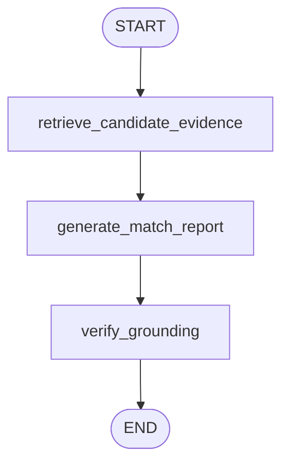

# CareerPilot architecture

## Runtime flow

The user-facing product is now a single companion with bounded working memory. The
formal match workflow remains a capability Pilot can invoke; it is no longer presented
as a group of agents or as the entire product experience.

```mermaid
sequenceDiagram
    actor User
    participant iOS as Optional Capacitor iOS client
    participant UI as Next.js UI
    participant API as FastAPI
    participant Local as Automatic local identity
    participant DB as Encrypted local provider store
    participant CareerDB as Device-local career.db
    participant Bridge as Loopback Hermes bridge
    participant Hermes as Hermes 0.18.2 profile
    participant Parse as CV parser
    participant Graph as LangGraph
    participant Vector as Chroma / MiniLM
    participant OpenAI as OpenAI API
    participant Codex as Codex app-server
    participant Guard as Grounding verifier
    participant Trace as Langfuse

    User->>UI: Open loopback CareerPilot
    opt Private iOS client
        User->>iOS: Choose private HTTPS runtime
        iOS->>API: Same static UI over capacitor://localhost
    end
    UI->>API: GET /local/session
    API->>Local: Create or reuse stable device identity
    Local->>DB: Resolve encrypted provider state
    API-->>UI: Local workspace state
    User->>UI: Open Settings and choose AI connection
    alt API key
        UI->>API: POST /settings/providers/api-key
        API->>OpenAI: Non-billable key validation
    else ChatGPT plan
        UI->>API: POST /settings/providers/codex/start
        API->>Codex: account/login/start (device code)
        Codex-->>UI: Verification URL + one-time code
        User->>Codex: Approve in OpenAI browser flow
        UI->>API: Poll /settings/providers/codex/status
    end
    Local->>DB: Encrypt provider credential; mark it active
    User->>UI: Open persistent career workspace
    UI->>API: GET /api/v1/profile, jobs, applications, routes
    API->>CareerDB: Open device-local operational database
    CareerDB-->>UI: Reviewed evidence and workflow state
    opt Hermes companion capability
        Hermes->>Bridge: Career tool + workspace bearer token
        Bridge->>CareerDB: Validated local operation
        CareerDB-->>Hermes: Evidence, state, or policy result
    end
    User->>UI: Paste or upload verified profile
    opt PDF, DOCX, or TXT upload
        UI->>API: POST /parse-cv
        API->>Parse: Bounded in-memory extraction
        Parse-->>UI: Editable plain text
    end
    User->>UI: Add job description
    User->>UI: Talk with Pilot using current session context
    UI->>API: POST /companion/chat/stream
    API->>CareerDB: Load session history and persist the user turn
    API->>CareerDB: Resolve interactive model route
    alt OpenAI API route
        API->>Hermes: Start profile with API key in child environment
        Hermes->>OpenAI: Agent run with restricted career tools
    else Codex subscription route
        API->>Hermes: Materialize account auth.json with mode 0600
        Hermes->>OpenAI: Codex subscription agent run
    end
    Hermes-->>API: Message and tool-progress SSE
    API->>CareerDB: Persist the completed assistant turn
    API-->>UI: Proxied SSE without credentials
    API->>DB: Re-encrypt refreshed Codex credentials when changed
    opt User asks for a grounded fit check
    UI->>API: POST /match
    API->>Graph: match_candidate_v3(request)
    Graph->>Vector: Chunk, embed, rank evidence
    Vector-->>Graph: candidate:0001… candidate:0006
    alt API-key connection
        Graph->>OpenAI: Strict JSON Schema + retrieved evidence
        OpenAI-->>Graph: Structured match report
    else Codex connection
        Graph->>Codex: Read-only ephemeral turn + output schema
        Codex-->>Graph: Structured match report + refreshed OAuth tokens
        Graph->>DB: Re-encrypt refreshed credentials
    end
    Graph->>Guard: Verify source IDs and verbatim quotes
    Guard-->>Graph: Grounded report or explicit failure
    Graph-->>API: Validated MatchResponse
    API-->>UI: JSON report
    UI-->>User: Score, evidence, gaps, plan, warnings
    Graph-->>Trace: Optional spans, versions, latency, tokens, failures
    end
```

The actual compiled LangGraph is deliberately linear:



## Responsibilities

| Component | Responsibility | Deliberately does not do |
| --- | --- | --- |
| Next.js | Host the Pilot conversation, manage provider Settings, and expose the persistent evidence/job/application/control workspace | Score or infer candidate skills |
| Companion turn | Discuss direction and next steps using bounded profile, role, history, and report context | Invent a formal fit score or perform external actions |
| FastAPI | Validate HTTP contracts, resolve the local workspace, and map safe errors | Expose provider credentials to the browser |
| Local credential store | Keep the stable device identity and encrypt provider and optional search credentials | Persist career documents or workflow state |
| Operational store | Persist reviewed evidence, jobs, applications, artifacts, approvals, routes, schedules, audit events, and revisions in the local `career.db` | Store provider credentials |
| Hermes supervisor | Resolve the interactive route, synchronize one connected provider, verify authenticated readiness, proxy SSE, and stop the child at invalidation or shutdown | Send provider, API-server, or bridge secrets to the browser |
| Hermes profile | Supply personality, session history, visible built-in skills, user-owned memory/skills, and restricted career/MCP tools synchronized from local Settings | Open `career.db`, receive provider secrets, submit applications, or let retrieved content mutate memory/skills/MCP/cron |
| Hermes bridge | Authenticate one opaque workspace key plus a local bearer token and invoke validated services | Expose itself remotely or return provider credentials |
| Codex app-server | Own ChatGPT OAuth refresh and plan-backed structured turns | Receive writable filesystem or network permission from CareerPilot |
| CV ingestion | Extract bounded PDF/DOCX/TXT text in memory | OCR images or persist uploads |
| Chroma | Rank candidate chunks using local MiniLM embeddings | Persist user profiles |
| GPT-5.6 Sol | Extract requirements and synthesize the structured analysis | Decide whether its own citations are trustworthy |
| Pydantic | Enforce the exact response shape and value bounds | Prove quotes came from sources |
| Grounding verifier | Check cited source IDs and verbatim candidate/JD quotes | Make semantic LLM judgments |
| Langfuse | Trace latency, usage, versions, and failures when enabled | Gate the user response |

## Trust boundaries

CareerPilot creates one stable local identity automatically and does not expose account,
password, Google login, logout, or session-cookie endpoints. AI-provider authorization
remains separate and is mandatory before model-backed features can run. A prior installation
with exactly one account is adopted as the local identity so its workspace and encrypted
provider connections are preserved.

Each local identity owns database-backed conversation sessions. The selected session ID,
ordered messages, CV/role working context, and latest fit report survive browser refreshes
and process restarts. Hermes receives a distinct opaque session key for each conversation,
so creating a new session does not merge runtime memory with an older one. The user-chosen
agent name and supplemental soul notes are stored in the database and mirrored to local
agent files; the runtime composes them beneath the immutable product safety policy.

Provider credentials never enter JavaScript storage. API keys and Codex `auth.json` blobs
are encrypted with a key derived from `CAREERPILOT_AUTH_SECRET`. Changing the application
secret invalidates stored credentials. Because there is no product authentication boundary,
the service must remain loopback-only or sit behind trusted host-level access control.

Codex device login is hosted by an isolated app-server process. Each analysis decrypts
credentials into a mode-0600 temporary `CODEX_HOME`, gives the process only a small
allowlist of required environment variables, starts an ephemeral read-only thread with
approvals disabled, captures refreshed credentials, re-encrypts them, and removes the
temporary directory. A developer instruction prohibits tools and external actions;
sandboxing enforces the important boundary even if source text attempts prompt injection.

Candidate and job text are untrusted data. They are JSON-serialized under explicit source
keys and the system prompt says that instructions inside those sources must be ignored.
Only retrieved candidate chunks are sent as admissible evidence in v3.

The stable local identity maps to an opaque SHA-256 directory beneath the companion data
root. Every operational request derives that path server-side, so the identifier never
becomes a user-controlled path. SQLite foreign keys are enabled for every connection.
The operational schema deliberately has no provider-credential table; all OpenAI API-key
and Codex OAuth writes remain in the encrypted local provider store.

Hermes runs in its own pinned environment and profile. Its plugin does not import the
CareerPilot application or database layer. It calls a hidden loopback-only API with an
opaque workspace-directory key and a random local bearer token held in the child
process environment. The browser never receives that token. The supervisor starts from a
small environment allowlist, then forwards only explicitly selected provider and tool
credentials. The default Hermes API-server toolset keeps terminal, file, and code
operations inside the device-local CareerPilot workspace. It excludes raw memory writes,
cron mutation, delegation, messaging, and general browser automation. Optional web search
receives only an encrypted user-owned search credential when configured. Pilot exposes
one finite form-preview tool bound to the exact latest user message. It accepts only an
application ID and a fixed field vocabulary, then creates a deterministic local JSON
artifact from verified evidence and exact approved application artifacts. It has no URL,
selector, browser, upload, click, approval-token, or submission surface. The existing
guarded browser-fill backend is not exposed to Pilot; a separately confirmed external
phase remains future work.

FastAPI starts Hermes on demand because the provider and task route are not known at
application startup. It owns the child until provider invalidation or application shutdown.
The `interactive` task route selects a connected
provider. Direct API keys exist only in the child environment; Codex credentials are
written atomically with private permissions to the installed local profile. Hermes
readiness is accepted only after an authenticated `/v1/capabilities` response. Refreshed
Codex credentials are re-encrypted in the local provider store after a run.

The LLM cannot make a displayed direct or adjacent match without a citation. After the
provider response passes Pydantic validation, plain Python checks every citation against
its declared retrieved chunk and checks every requirement quote against the original job
description. An invalid citation turns the request into a controlled provider error.

Uploaded CVs are limited before parsing. DOCX archives are checked for file count and
expanded size, PDFs are limited to 30 pages, and extracted text must fit the same 50,000
character API contract. The parser does not execute OCR and rejects image-only documents.

This does not prove that every semantic classification is perfect. The fixed evaluation
set therefore checks expected score bands, required matches and gaps, forbidden matches,
and verbatim evidence across strong, partial, and mismatch examples.

## Build Week tradeoffs

- Ephemeral Chroma keeps setup and data retention simple; it re-embeds each profile.
- Separate SQLite provider and operational stores make the local-first product easy to
  back up and keep credentials outside career data. It is not a horizontal-scaling
  design; PostgreSQL is the next hosted-storage migration.
- Device-code authorization belongs to the local workspace and works without
  exposing localhost callback ports, at the cost of one extra code-entry step.
- Local MiniLM avoids a second paid API and makes retrieval testable offline.
- One model generation keeps latency and cost demo-friendly.
- LangGraph makes the workflow and failure stages visible without wrapping ordinary code
  in LangChain.
- Authentication, multi-user isolation, rate limiting, consent records, audit logs, and
  formal retention controls are required before any public deployment.
